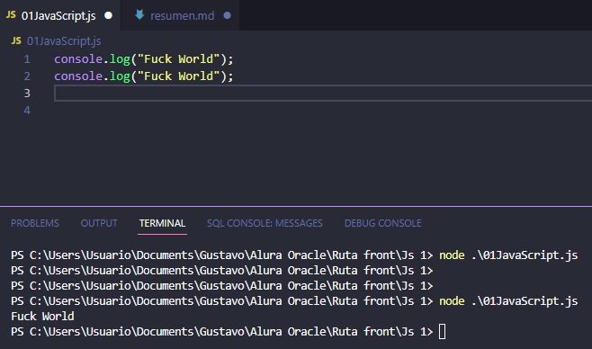
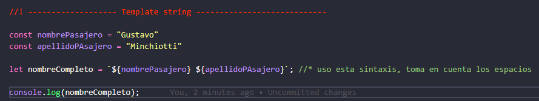
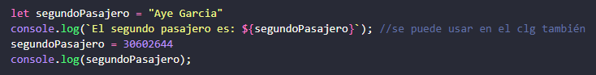
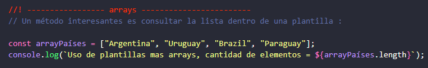
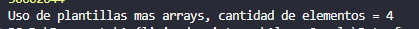

# Js

## Primeros pasos otra vez

### Instale node en la netbook nueva ahora hago una sencilla prueba de hola mundo

Creo el archivo `.JS` hago el console log, luego en la terminal escribo node mas el nombre el archivo luego enter y lo 
ejecuta en primer momento no tomo el print luego si lo hizo. ver de poner la imagen en el Md.

### Uso de plantillas String

* En este caso se usa la interpolación Js sabe que dentro de la plantilla voy a usar otras variables
* no es necesario concatenar con el +.

También vimos que Js convierte libremente el tipo de dato ejemplo string y número

Clase 3 - 2 muestra arrays, no voy a hacer resumen ni ejercicio.

## Listas Arrays 
Sumado a lo de OB agrego el uso de plantillas

## Switch codigo en la carpeta.

Clase bucles 2 muestra el uso del depurador

.